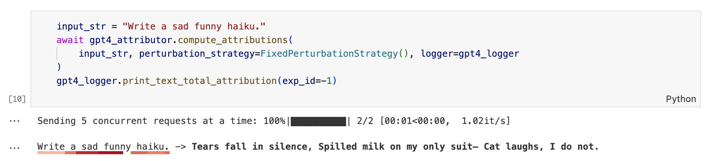
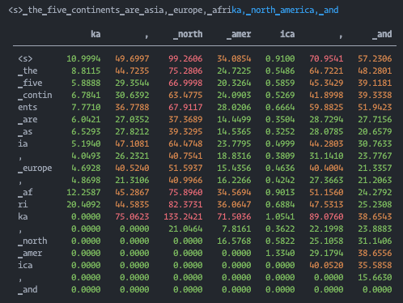

# LLM Attribution Library

The LLM Attribution Library is designed to compute the contribution of each token in a prompt to the generated response of a language model.  

It can be used with OpenAI LLMs accessible through an API:  


and local LLMs:


And 
## Index  
- [Quickstart](#quickstart)
- [Requirements](#requirements)
  - [Packaging](#packaging)
  - [Linting](#linting)
- [Installation](#installation)
- [API Design](#api-design)
  - [BaseLLMAttributor](#basellmattributor)
  - [LocalLLMAttributor](#localllmattributor)
  - [OpenAIAttributor](#OpenAIAttributor)
  - [PerturbationStrategy and AttributionStrategy](#perturbationstrategy-and-attributionstrategy)
  - [ExperimentLogger](#experimentlogger)
- [Limitations](#limitations)
  - [Batch dimensions](#batch-dimensions)
  - [Input Embeddings](#input-embeddings)
- [GPU Acceleration](#gpu-acceleration)
- [Development](#development)
- [Testing](#testing)

## Quickstart


Attrubution via OpenAI's API:  

# !!! This will use API credits !!!

```python
from attribution.api_attribution import OpenAIAttributor
from attribution.experiment_logger import ExperimentLogger
from attribution.token_perturbation import NthNearestPerturbationStrategy

# set your "OPENAI_API_KEY" environment variable to your openai API key, or pass it here:
attributor = OpenAIAttributor(openai_api_key=YOUR_OPENAI_API_KEY)
logger = ExperimentLogger()

input_text = "The clock shows 9:47 PM. How many minutes 'til 10?"
attributor.compute_attributions(
    input_text,
    perturbation_strategy=NthNearestPerturbationStrategy(n=-1),
    attribution_strategies=["cosine", "prob_diff"],
    logger=logger,
    perturb_word_wise=True,
)

logger.print_sentence_attribution()
logger.print_attribution_matrix(exp_id=1)

```

Example of gradient-based attrubution using gemma-2b locally:

```python
from transformers import AutoModelForCausalLM, AutoTokenizer
from attribution.attribution import Attributor

model_id = "google/gemma-2b-it"
model = AutoModelForCausalLM.from_pretrained(model_id, device_map="auto").cuda()
tokenizer = AutoTokenizer.from_pretrained(model_id)
embeddings = model.get_input_embeddings().weight.detach()

attributor = Attributor(model=model, embeddings=embeddings, tokenizer=tokenizer)
attr_scores, token_ids = attributor.get_attributions(
    input_string="the five continents are asia, europe, afri",
    generation_length=7,
)

attributor.print_attributions(
    word_list=tokenizer.convert_ids_to_tokens(token_ids),
    attr_scores=attr_scores,
    token_ids=token_ids,
    generation_length=7,
)
```

Usage examples can be found in the `examples/` folder. There's also a colab-hosted quickstart notebook [here](https://colab.research.google.com/drive/1yf6izSzZg2K88QyaJwAwkZPPyLP4pPa-?usp=sharing).

## Requirements

### Packaging

This project uses [uv](https://github.com/astral-sh/uv) for package management. To install `uv`, follow the installation instructions in the [uv docs](https://github.com/astral-sh/uv?tab=readme-ov-file#getting-started).

### Linting

This project uses [ruff](https://github.com/astral-sh/ruff) for linting and formatting. To install `ruff`, follow the installation instructions in the [ruff docs](https://github.com/astral-sh/ruff?tab=readme-ov-file#getting-started).

## Installation

1. First, clone the repository:

```bash
git clone git@github.com:leap-laboratories/PIZZA.git
```

2. Navigate into the cloned directory:

```bash
cd PIZZA
```

3. Create a virtual environment and activate it:

```bash
uv venv
source .venv/bin/activate
```

4. To install the dependencies needed to use the library:

```bash
uv pip install -r requirements.txt
```

Or to install the dependencies needed to do development on the library:
```bash
uv pip install -r requirements-dev.txt
```

Now, you should be able to import and use the library in your Python scripts.

5. To update the lock files that specify the dependency versions:
```bash
uv pip compile requirements.in -o requirements.txt
uv pip compile requirements-dev.in -o requirements-dev.txt
```

## API Design

The attributors are designed to compute the contribution made by each token in an input string to the tokens generated by a language model.

### BaseLLMAttributor

[BaseLLMAttributor] is an abstract base class that defines the interface for all LLM attributors. It declares the `compute_attributions` method, which must be implemented by any concrete attributor class. This method takes an input text and computes the attribution scores for each token.

```python
class BaseLLMAttributor(ABC):
    @abstractmethod
    def compute_attributions(
        self, input_text: str, **kwargs
    ) -> Optional[Tuple[torch.Tensor, torch.Tensor]]:
        pass
```

### LocalLLMAttributor

`LocalLLMAttributor` uses a local model to compute attributions. The model, tokenizer, and embeddings are passed to the constructor.

```python
class LocalLLMAttributor:
    def __init__(
        self,
        model: nn.Module,
        tokenizer: transformers.PreTrainedTokenizerBase,
        embeddings: torch.Tensor,
        device: Optional[str] = None,
        log_level: int = logging.WARNING,
    ):
        ...
    def compute_attributions(
        self, input_string: str, **kwargs
    ) -> Tuple[torch.Tensor, torch.Tensor]:
        ...
```

The `compute_attributions` method generates tokens from the input string and computes the gradients of the output with respect to the input embeddings. These gradients are used to compute the attribution scores.

`LocalLLMAttributor` uses gradient-based attribution to quantify the influence of input tokens on the output of a model. For each output token, it computes the gradients with respect to the input embeddings. The L1 norm of these gradients is then used as the attribution score, representing the total influence of each input token on the output


#### Cleaning Up

A convenience method is provided to clean up memory used by Python and Torch. This can be useful when running the library in a cloud notebook environment:

```python
local_attributor.cleanup()
```

### OpenAIAttributor

`OpenAIAttributor` uses the OpenAI API to compute attributions. Given that gradients are not accessible, the attributor perturbs the input with a given `PerturbationStrategy` and measures the magnitude of change of the generated output with an `attribution_strategy`.

The `compute_attributions` method:
1. Sends a chat completion request to the OpenAI API.
2. Uses a `PerturbationStrategy` to modify the input prompt, and sends the perturbed input to OpenAI's API to generate a perturbed output. Each token of the input prompt is perturbed separately, to obtain an attribution score for each input token.
3. Uses an `attribution_strategy` to compute the magnitude of change between the original and perturbed output.
4. Logs attribution scores to an `ExperimentLogger` if passed.

```python
class OpenAIAttributor(BaseLLMAttributor):
    def __init__(
        self,
        openai_api_key: Optional[str] = None,
        openai_model: Optional[str] = None,
        tokenizer: Optional[PreTrainedTokenizer] = None,
        token_embeddings: Optional[np.ndarray] = None,
    ):
        openai_api_key = openai_api_key or os.getenv("OPENAI_API_KEY")
        self.openai_client = openai.OpenAI(api_key=openai_api_key)
        self.openai_model = openai_model or "gpt-3.5-turbo"

        self.tokenizer = tokenizer or GPT2Tokenizer.from_pretrained("gpt2")
        self.token_embeddings = token_embeddings or GPT2LMHeadModel.from_pretrained("gpt2").transformer.wte.weight.detach().numpy()

```

### PerturbationStrategy and AttributionStrategy

`PerturbationStrategy` is an abstract base class that defines the interface for all perturbation strategies. It declares the `get_replacement_token` method, which must be implemented by any concrete perturbation strategy class. This method takes a token id and returns a replacement token id.

The `attribution_strategy` parameter is a string that specifies the method to use for computing attributions. The available strategies are "cosine" and "prob_diff".

- **Cosine Similarity Attribution**: Measures the cosine similarity between the embeddings of the original and perturbed outputs. The embeddings are obtained from a pre-trained model (e.g. GPT2). The cosine similarity is calculated for each pair of tokens in the same position on the original and perturbed outputs. For example, it compares the token in position 0 in the original response to the token in position 0 in the perturbed response. Additionally, the cosine similarity of the entire sentence embeddings is computed. The difference in sentence similarity and token similarities are returned.

- **Probability Difference Attribution**: Calculates the absolute difference in probabilities for each token in the original and perturbed outputs. The probabilities are obtained from the `top_logprobs` field of the tokens, which contains the most likely tokens for each token position. The mean of these differences is returned, as well as the probability difference for each token position.

- **Token Displacement Attribution**: Calculates the displacement of each token in the original output within the perturbed output's `top_logprobs` predicted tokens. The `top_logprobs` field contains the most likely tokens for each token position. If a token from the original output is not found in the `top_logprobs` of the perturbed output, a maximum displacement value is assigned. The mean of these displacements is returned, as well as the displacement of each original output token.


### ExperimentLogger

The `ExperimentLogger` class is used to log the results of different experiment runs. It provides methods for starting and stopping an experiment, logging the input and output tokens, and logging the attribution scores. The `api_llm_attribution.ipynb` notebook shows an example of how to use `ExperimentLogger` to compare the results of different attribution strategies.


## Limitations

### Batch dimensions

Currently this library only supports models that take inputs with a batch dimension. This is common across most modern models, but not always the case (e.g. GPT2).

### Input Embeddings

This library only supports models that have a common interface to pass in embeddings, and generate outputs without sampling of the form:

```python
outputs = model(inputs_embeds=input_embeddings)
```

This format is common across HuggingFace models.

## GPU Acceleration

To run the attribution process on a device of your choice (for local attribution), pass the device identifier into the `Attributor` class constructor:

```python
attributor = Attributor(
    model=model,
    tokenizer=tokenizer,
    device="cuda:0"
)
```

The device identifider must match the device used on the first embeddings layer of your model.

If no device is specified, the model device will be used by default.


## Development

To contribute to the library, you will need to install the development requirements:

```bash
uv pip install -r requirements-dev.txt
```

## Testing

This project uses pytest for unit and integration testing.

To run the unit tests:

```bash
python -m pytest tests/unit
```

To run the integration tests:

```bash
python -m pytest tests/integration
```

## Research 
Some preliminary exploration and research into using attribution and quantitatively measuring attribution success can be found in the examples folder of this repository. We'd be excited to see expansion of this small library, including both algorithmic improvements, further attribution and perturbation methods, and more rigorous and exhaustive experimentation. We welcome pull requests and issues from external collaborators.
