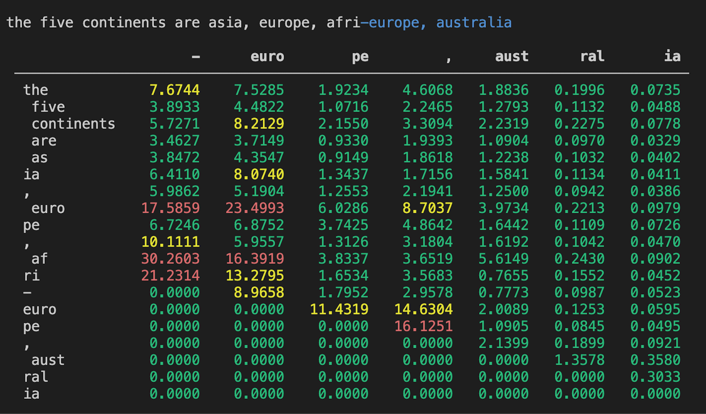

# LLM Attribution Library

The LLM Attribution Library is a Python package designed to compute the attributions of each token in an input string to the generated tokens in a language model. This is particularly useful for understanding the influence of specific input tokens on the output of a language model.



## Technical Overview

The library uses gradient-based attribution to quantify the influence of input tokens on the output of a GPT-2 model. For each output token, it computes the gradients with respect to the input embeddings. The L1 norm of these gradients is then used as the attribution score, representing the total influence of each input token on the output. This approach provides a direct measure of the sensitivity of the output to changes in the input, aiding in model interpretation and diagnosis.

## Installation

1. First, clone the repository:

```bash
git clone git@github.com:leap-laboratories/llm-attribution.git
```

2. Navigate into the cloned directory:

```bash
cd llm-attribution
```

3. Create a virtual environment and activate it:

```bash
uv venv
source .venv/bin/activate
```

4. Install the requirements:

```bash
uv pip install -r requirements.txt
```

Now, you should be able to import and use the library in your Python scripts.

## Usage

Here is a basic example of how to use the library:

```python
import transformers
from attribution.attribution import Attributor

model_name = "distilgpt2"
tokenizer = transformers.GPT2Tokenizer.from_pretrained(model_name, padding_side="left")
tokenizer.pad_token = tokenizer.eos_token
model = transformers.GPT2LMHeadModel.from_pretrained(model_name)

if not isinstance(model, transformers.GPT2LMHeadModel):
    raise ValueError("model not found")

model.eval()

attributor = Attributor(model=model, tokenizer=tokenizer)
attr_scores, token_ids = attributor.get_attributions(
    input_string="the five continents are asia, europe, afri",
    generation_length=7,
)

attributor.print_attributions(
    word_list=[tokenizer.decode(token_id) for token_id in token_ids],
    attr_scores=attr_scores,
    token_ids=token_ids,
    generation_length=7,
)
```

You can run this script with `example.py`.

### GPU Acceleration

To run the attribution process on a device of your choice, pass the device identifier into the `Attributor` class constructor:

```python
attributor = Attributor(
    model=model,
    tokenizer=tokenizer,
    device="cuda:0"
)
```

The device identifider must match the device used on the first embeddings layer of your model.

If no device is specified, the model device will be used by default.

### Logging

The library uses the `logging` module to log messages. You can configure the logging level via an optional argument in the `Attributor` class constructor:

```python
import logging

attributor = Attributor(
    model=model,
    tokenizer=tokenizer,
    log_level=logging.INFO
)
```

## Development

To contribute to the library, you will need to install the development requirements:

```bash
uv pip install -r requirements-dev.txt
```
