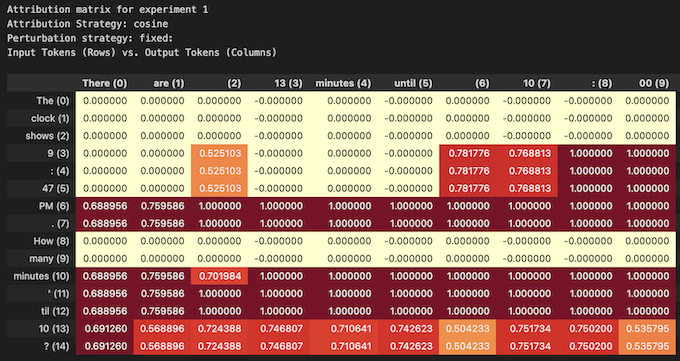

# PIZZA

PIZZA: an LLM Attribution Library © 2024 by [Leap Laboratories](https://www.leap-labs.com/) is licensed under [CC BY-NC-SA 4.0](https://creativecommons.org/licenses/by-nc-sa/4.0/?ref=chooser-v1)

`P`rompt `I`nput `Z`onal `Z`? `A`ttribution analyzer

[PIZZA](https://www.bmj.com/content/349/bmj.g7092) is an LLM Attribution Library designed to compute the contribution of each token in a prompt to the generated response of a language model.

It can be used with OpenAI LLMs accessible through an API:




and local LLMs:


- [PIZZA](#pizza)
  - [Setup](#setup)
    - [Requirements](#requirements)
      - [Packaging](#packaging)
      - [Linting](#linting)
    - [Installation](#installation)
    - [Initial Configuration](#initial-configuration)
      - [Pre-commit hooks](#pre-commit-hooks)
      - [Environment Variables](#environment-variables)
  - [Quickstart](#quickstart)
    - [Attribution via OpenAI's API](#attribution-via-openais-api)
      - [Iterative perturbation](#iterative-perturbation)
      - [Hierarchical perturbation](#hierarchical-perturbation)
    - [Local attribution](#local-attribution)
      - [Using gradient-based attribution for gemma-2b](#using-gradient-based-attribution-for-gemma-2b)
  - [API Design](#api-design)
    - [BaseLLMAttributor and BaseAsyncLLMAttributor](#basellmattributor-and-baseasyncllmattributor)
    - [LocalLLMAttributor](#localllmattributor)
      - [Cleaning Up](#cleaning-up)
    - [OpenAIAttributor](#openaiattributor)
      - [Attribution methods](#attribution-methods)
    - [PerturbationStrategy and AttributionStrategy](#perturbationstrategy-and-attributionstrategy)
    - [ExperimentLogger](#experimentlogger)
  - [Limitations](#limitations)
    - [Batch dimensions](#batch-dimensions)
    - [Input Embeddings](#input-embeddings)
  - [GPU Acceleration](#gpu-acceleration)
  - [Development](#development)
  - [Testing](#testing)
  - [Research](#research)

## Setup

### Requirements

#### Packaging

This project uses [uv](https://github.com/astral-sh/uv) for package management. To install `uv`, follow the installation instructions in the [uv docs](https://github.com/astral-sh/uv?tab=readme-ov-file#getting-started).

#### Linting

This project uses [ruff](https://github.com/astral-sh/ruff) for linting and formatting. To install `ruff`, follow the installation instructions in the [ruff docs](https://github.com/astral-sh/ruff?tab=readme-ov-file#getting-started).

### Installation

1. First, clone the repository:

```bash
git clone git@github.com:leap-laboratories/PIZZA.git
```

2. Navigate into the cloned directory:

```bash
cd PIZZA
```

3. Create a virtual environment and activate it:

```bash
uv venv
source .venv/bin/activate
```

4. To install the dependencies needed to use the library:

```bash
uv pip install -r requirements.txt
```

Or to install the dependencies needed to do development on the library:

```bash
uv pip install -r requirements-dev.txt
```

Now, you should be able to import and use the library in your Python scripts.

During development, ff you change the requirements listed in `requirements.in` or `requirements-dev.in`, you can use these commands to update the lock files that specify the dependency versions:

```bash
uv pip compile requirements.in -o requirements.txt
uv pip compile requirements-dev.in -o requirements-dev.txt
```

### Initial Configuration

#### Pre-commit hooks

This project performs linting and formatting checks in CI to ensure consistency of code style. Rather than waiting for CI to run, you can install pre-commit hooks to run these checks locally before you commit your changes.

To install the pre-commit hooks, run the following command:

```bash
pre-commit install
```

This will install the pre-commit hooks defined in the `.pre-commit-config.yaml` file. Now, when you commit changes, the pre-commit hooks will run automatically.

You may find that the pre-commit 'fails', even though the changes have been applied automaically by the hook (e.g. formatting changes). This is because the hook only makes the changes to the code, but does not add them to the commit stage. To finish your commit, add the changes to your commit stage, and then commit again.

#### Environment Variables

This project uses `python-dotenv` to load environment variables and keep secret keys out of source control. To use this feature, create a `.env` file in the root of the project and add your environment variables there. For example:

```bash
echo "OPENAI_API_KEY=your_openai_api_key" > .env
```

The `.env` file is already included in the `.gitignore` file, so it will not be checked into source control.

To load the envioroment variables listed in `.env` in your Python scripts, add the following code at the top of your script:

```python
from dotenv import load_dotenv
load_dotenv()
```

Or to load them into the environment of a Jupyter notebook:

```python
%load_ext dotenv
%dotenv
```

For more information see the [python-dotenv documentation](https://pypi.org/project/python-dotenv/).

## Quickstart

### Attribution via OpenAI's API

> [!WARNING]  
> Using the `OpenAIAttributor` will use API credits.

The `OpenAIAttributor` is asynchronous and will make multiple requests concurrently, so make sure to check your OpenAI limits and set `max_concurrent_requests` accordingly.

#### Iterative perturbation

```python
import asyncio

from attribution.api_attribution import OpenAIAttributor
from attribution.experiment_logger import ExperimentLogger

# OpenAIAttributor can read your "OPENAI_API_KEY" environment variable directly, or pass it here:
attributor = OpenAIAttributor(
    openai_api_key=YOUR_OPENAI_API_KEY,
    max_concurrent_requests=5,
)

logger = ExperimentLogger()

input_text = "The clock shows 9:47 PM. How many minutes 'til 10?"
attribution_task = attributor.iterative_perturbation(
    input_text,
    logger=logger,
)

asyncio.run(attribution_task)

logger.print_attribution_matrix()
```

#### Hierarchical perturbation

```python
import asyncio

from attribution.api_attribution import OpenAIAttributor
from attribution.experiment_logger import ExperimentLogger

attributor = OpenAIAttributor(
    openai_api_key=YOUR_OPENAI_API_KEY,
    max_concurrent_requests=5,
)

logger = ExperimentLogger()

input_text = "The clock shows 9:47 PM. How many minutes 'til 10?"
attribution_task = attributor.hierarchical_perturbation(
    input_text,
    logger=logger
)

asyncio.run(attribution_task)
logger.print_attribution_matrix()
```

### Local attribution

#### Using gradient-based attribution for gemma-2b

```python
from transformers import AutoModelForCausalLM, AutoTokenizer
from attribution.attribution import Attributor

model_id = "google/gemma-2b-it"
model = AutoModelForCausalLM.from_pretrained(model_id, device_map="auto").cuda()
tokenizer = AutoTokenizer.from_pretrained(model_id)
embeddings = model.get_input_embeddings().weight.detach()

attributor = Attributor(model=model, embeddings=embeddings, tokenizer=tokenizer)
attr_scores, token_ids = attributor.get_attributions(
    input_string="the five continents are asia, europe, afri",
    generation_length=7,
)

attributor.print_attributions(
    word_list=tokenizer.convert_ids_to_tokens(token_ids),
    attr_scores=attr_scores,
    token_ids=token_ids,
    generation_length=7,
)
```

More usage examples can be found in the `examples/` folder.

## API Design

The attributors are designed to compute the contribution made by each token in an input string to the tokens generated by a language model.

### BaseLLMAttributor and BaseAsyncLLMAttributor

`BaseLLMAttributor` and `BaseAsyncLLMAttributor` are abstract base classes that define the interfaces for all LLM attributors. They declare the `iterative_perturbation` method, which must be implemented by any concrete attributor class. This method takes an input text and computes the attribution scores for each token.

Note that `BaseAsyncLLMAttributor` uses `asyncio` to makes requests and therefore calls to `iterative_perturbation` in concrete classes (such as `OpenAIAttributor`) must be awaited using the `await` keyword.

```python
class BaseLLMAttributor(ABC):
    @abstractmethod
    def iterative_perturbation(
        self, input_text: str, *args, **kwargs
    ) -> Optional[Tuple[torch.Tensor, torch.Tensor]]:
        pass


class BaseAsyncLLMAttributor(ABC):
    @abstractmethod
    async def iterative_perturbation(
        self, input_text: str, *args, **kwargs
    ) -> Optional[Tuple[torch.Tensor, torch.Tensor]]:
        pass
```

### LocalLLMAttributor

`LocalLLMAttributor` uses a local model to compute attributions. The model, tokenizer, and embeddings are passed to the constructor.

```python
class LocalLLMAttributor:
    def __init__(
        self,
        model: nn.Module,
        tokenizer: transformers.PreTrainedTokenizerBase,
        embeddings: torch.Tensor,
        device: Optional[str] = None,
        log_level: int = logging.WARNING,
    ):
        ...
    def iterative_perturbation(
        self, input_string: str, generation_length: int = 5
    ) -> Tuple[torch.Tensor, torch.Tensor]:
        ...
```

The `iterative_perturbation` method generates tokens from the input string and computes the gradients of the output with respect to the input embeddings. These gradients are used to compute the attribution scores.

`LocalLLMAttributor` uses gradient-based attribution to quantify the influence of input tokens on the output of a model. For each output token, it computes the gradients with respect to the input embeddings. The L1 norm of these gradients is then used as the attribution score, representing the total influence of each input token on the output

#### Cleaning Up

A convenience method is provided to clean up memory used by Python and Torch. This can be useful when running the library in a cloud notebook environment:

```python
local_attributor.cleanup()
```

### OpenAIAttributor

#### Attribution methods

`OpenAIAttributor` uses the OpenAI API to compute attributions. Given that gradients are not accessible, the attributor perturbs the input with a given `PerturbationStrategy` and measures the magnitude of change of the generated output with an `attribution_strategy`.

There are two methods for computing attributions in the `OpenAIAttributor`: `iterative_perturbation` and `hierarchical_perturbation`.

The `iterative_perturbation` method:

1. Sends a chat completion request to the OpenAI API.
2. Uses a `PerturbationStrategy` to modify the input prompt, and sends the perturbed input to OpenAI's API to generate a perturbed output. Each token of the input prompt is perturbed separately, to obtain an attribution score for each input token.
3. Uses an `attribution_strategy` to compute the magnitude of change between the original and perturbed output.
4. Logs attribution scores to an `ExperimentLogger` if passed.

The `hierarchical_perturbation` method is designed to reduce the number of API calls by perturbation larger chunks of the input prompt initially, and narrowing its search only on the chunks which have a large impact on the output (high attribution score).

The flow is similar to that of `iterative_perturbation`, but using an iterative technique that works as follows:

1. The prompt is split into chunks defined by `init_chunk_size` and `stride` (optional).
2. The chunks are perturbed, sent to the API, and scores are calculated/logged as described above.
3. Thresholds are used to determine which chunks should be further processed based on the chunk attribution scores.
4. Chunks are subdivided, and the process returns to step 2 until none of the processed chunks exceed the thresholds _or_ no further subdivision is possible.

There are currently two thresholds that define whether a chunk should be processed further:

1. Dynamic threshold: here a _cumulative_ attribution is defined per token which is incremented every step by the chunk(s) containing a given token. The threshold is then defined as the midrange of these token attributions.
2. Static threshold: for each chunk at a given step in the process, the overall attribution score is compared to a set threshold, defined by the input argument `static_threshold` (`Optional[float]`), depending on the attribution metric used. For example, `static_threshold=0.5` could be a reasonable input for the probability difference attribution method.

Note if more than one `attribution_strategies` are passed, only the first will be used in threshold calculations and comparison.

**Initialization Parameters:**

- `openai_api_key` (`Optional[str]`): Your OpenAI API key. If not provided, the class attempts to retrieve the API key from the `OPENAI_API_KEY` environment variable.
- `openai_model` (`Optional[str]`): The identifier for the OpenAI model you wish to use. If not specified, a default model is used. This allows for flexibility in choosing between different models for different tasks or preferences.
  - Default: gpt-3.5-turbo
- `tokenizer` (`Optional[PreTrainedTokenizer]`): An instance of a tokenizer compatible with the chosen model. If not provided, the class defaults to using the `GPT2Tokenizer` with the "gpt2" model, suitable for general-purpose text processing.
- `token_embeddings` (`Optional[np.ndarray]`): Pre-computed embeddings for tokens. If not provided, the class will default to using embeddings from the `GPT2LMHeadModel` for the "gpt2" model. This is useful for advanced use cases where custom or pre-computed embeddings are desired.

### PerturbationStrategy and AttributionStrategy

`PerturbationStrategy` is an abstract base class that defines the interface for all perturbation strategies. It declares the `get_replacement_token` method, which must be implemented by any concrete perturbation strategy class. This method takes a token id and returns a replacement token id.

The `attribution_strategy` parameter is a string that specifies the method to use for computing attributions. The available strategies are "cosine" and "prob_diff".

- **Cosine Similarity Attribution**: Measures the cosine similarity between the embeddings of the original and perturbed outputs. The embeddings are obtained from a pre-trained model (e.g. GPT2). The cosine similarity is calculated for each pair of tokens in the same position on the original and perturbed outputs. For example, it compares the token in position 0 in the original response to the token in position 0 in the perturbed response. Additionally, the cosine similarity of all of the embeddings together is computed. The difference in total similarity and token similarities are returned.

- **Probability Difference Attribution**: Calculates the absolute difference in probabilities for each token in the original and perturbed outputs. The probabilities are obtained from the `top_logprobs` field of the tokens, which contains the most likely tokens for each token position. The mean of these differences is returned, as well as the probability difference for each token position.

- **Token Displacement Attribution**: Calculates the displacement of each token in the original output within the perturbed output's `top_logprobs` predicted tokens. The `top_logprobs` field contains the most likely tokens for each token position. If a token from the original output is not found in the `top_logprobs` of the perturbed output, a maximum displacement value is assigned. The mean of these displacements is returned, as well as the displacement of each original output token.

### ExperimentLogger

The `ExperimentLogger` class is used to log the results of different experiment runs. It provides methods for starting and stopping an experiment, logging the input and output tokens, and logging the attribution scores. The `api_llm_attribution.ipynb` notebook shows an example of how to use `ExperimentLogger` to compare the results of different attribution strategies.

## Limitations

### Batch dimensions

Currently this library only supports models that take inputs with a batch dimension. This is common across most modern models, but not always the case (e.g. GPT2).

### Input Embeddings

This library only supports models that have a common interface to pass in embeddings, and generate outputs without sampling of the form:

```python
outputs = model(inputs_embeds=input_embeddings)
```

This format is common across HuggingFace models.

## GPU Acceleration

To run the attribution process on a device of your choice (for local attribution), pass the device identifier into the `Attributor` class constructor:

```python
attributor = Attributor(
    model=model,
    tokenizer=tokenizer,
    device="cuda:0"
)
```

The device identifider must match the device used on the first embeddings layer of your model.

If no device is specified, the model device will be used by default.

## Development

To contribute to the library, you will need to install the development requirements:

```bash
uv pip install -r requirements-dev.txt
```

## Testing

This project uses pytest for unit and integration testing.

To run the unit tests:

```bash
python -m pytest tests/unit
```

To run the integration tests:

```bash
python -m pytest tests/integration
```

## Research

Some preliminary exploration and research into using attribution and quantitatively measuring attribution success can be found in the examples folder of this repository. We'd be excited to see expansion of this small library, including both algorithmic improvements, further attribution and perturbation methods, and more rigorous and exhaustive experimentation. We welcome pull requests and issues from external collaborators.
